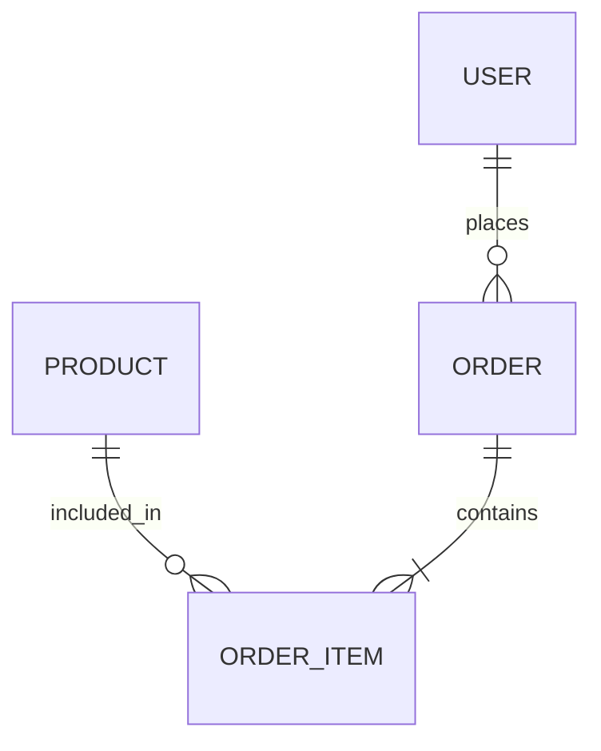

````markdown
# MERNus — Full-Stack CRUD Admin Dashboard

MERNus is a full-stack admin dashboard built with the MERN stack for managing users, products, and orders from a single interface. The application uses an Express and Mongoose backend to expose REST APIs over MongoDB, while the React frontend provides a polished dashboard for creating, viewing, updating, and deleting records.

## Documentation

- [Backend documentation](backend/README.md)
- [Frontend documentation](frontend/README.md)

## Project Overview

This project demonstrates a practical CRUD workflow for an internal admin system. The frontend is a React + Vite application with Tailwind CSS for building a responsive and modern user interface, while the backend is an Express server connected to MongoDB through Mongoose. The application provides complete Create, Read, Update, and Delete (CRUD) functionality for managing users, products, and orders.

## Features

- User CRUD operations
- Product CRUD operations
- Order CRUD operations
- Dashboard summary cards
- Search and filtering for users, products, and orders
- Product and user selection while creating orders
- Dynamic order items with quantity and price calculation
- Delete confirmation dialogs
- Form validation with loading, success, and error states
- Responsive UI built using Tailwind CSS

## Tech Stack

| Layer | Technology |
|-------|------------|
| Frontend | React, Vite, Tailwind CSS |
| Backend | Node.js, Express.js, Mongoose |
| Database | MongoDB Atlas |
| Package Manager | npm |
| Version Control | Git, GitHub |

## Architecture

The frontend communicates with the backend through REST APIs over HTTP. Requests are handled by Express routes, processed by controllers, which interact with Mongoose models before reading or writing data to MongoDB Atlas.

```mermaid
flowchart LR
    A[React Frontend] --> B[Express REST API]
    B --> C[Controllers]
    C --> D[Mongoose Models]
    D --> E[MongoDB Atlas]
````

## Project Structure

```text
MERNus/
├── backend/
│   ├── src/
│   │   ├── config/
│   │   ├── controllers/
│   │   ├── model/
│   │   └── routes/
│   ├── server.js
│   ├── package.json
│   └── .env
│
├── frontend/
│   ├── src/
│   │   ├── components/
│   │   ├── pages/
│   │   ├── services/
│   │   └── App.jsx
│   ├── package.json
│   ├── vite.config.js
│   └── .env
│
├── README.md
└── .gitignore
```

## Data Model Relationships

The backend uses three primary Mongoose models.

### User

Stores user information including:

* Name
* Email
* Age

### Product

Stores product details including:

* Name
* Description
* Category
* Price
* Stock
* Availability

### Order

Stores:

* User reference
* Ordered products
* Quantity
* Total amount
* Shipping details
* Payment details
* Order status

Orders reference Users and Products using MongoDB ObjectIds. Mongoose `populate()` is used to automatically retrieve related user and product information when fetching order data.



## Getting Started

### Prerequisites

Before running the project, ensure you have:

* Node.js
* npm
* MongoDB Atlas account (or local MongoDB server)

---

## Clone Repository

```bash
git clone https://github.com/jaswanthbadipati/Mern_Training.git
```

```bash
cd MERNus
```

---

## Backend Setup

Move into the backend directory.

```bash
cd backend
```

Install dependencies.

```bash
npm install
```

Create a `.env` file.

```env
MONGODB_URL=your_mongodb_connection_string
PORT=3000
```

Start the backend.

```bash
npm run dev
```

---

## Frontend Setup

Move into the frontend directory.

```bash
cd ../frontend
```

Install dependencies.

```bash
npm install
```

Create a `.env` file.

```env
VITE_API_BASE_URL=http://localhost:3000
```

Start the frontend.

```bash
npm run dev
```

The application will usually be available at:

```
http://localhost:5173
```

## Environment Variables

| Location | Variable          | Description               |
| -------- | ----------------- | ------------------------- |
| Backend  | PORT              | Express server port       |
| Backend  | MONGODB_URL       | MongoDB connection string |
| Frontend | VITE_API_BASE_URL | Backend API URL           |

## REST API Endpoints

### Users

| Method | Endpoint   | Description    |
| ------ | ---------- | -------------- |
| POST   | /users     | Create User    |
| GET    | /users     | Get All Users  |
| GET    | /users/:id | Get User by ID |
| PUT    | /users/:id | Update User    |
| DELETE | /users/:id | Delete User    |

### Products

| Method | Endpoint      | Description       |
| ------ | ------------- | ----------------- |
| POST   | /products     | Create Product    |
| GET    | /products     | Get All Products  |
| GET    | /products/:id | Get Product by ID |
| PUT    | /products/:id | Update Product    |
| DELETE | /products/:id | Delete Product    |

### Orders

| Method | Endpoint    | Description     |
| ------ | ----------- | --------------- |
| POST   | /orders     | Create Order    |
| GET    | /orders     | Get All Orders  |
| GET    | /orders/:id | Get Order by ID |
| PUT    | /orders/:id | Update Order    |
| DELETE | /orders/:id | Delete Order    |

## CRUD Workflow

The application provides dedicated interfaces for creating, viewing, updating, and deleting Users, Products, and Orders.

Features include:

* Interactive dashboard
* Resource management pages
* Search functionality
* Confirmation dialogs before deletion
* Responsive forms
* Validation messages
* Success and error notifications

## Future Improvements

Potential enhancements include:

* JWT Authentication
* Role-based Authorization
* Product image uploads
* Pagination
* Server-side search and filtering
* Inventory management
* Analytics dashboard
* Docker support
* Automated testing
* CI/CD pipelines
* Cloud deployment

## Author

**Jaswanth Badipati**

* B.Tech – Artificial Intelligence & Data Science
* Full-Stack & AI/ML Developer

## License

This project currently does not specify a license.

Feel free to add an MIT, Apache 2.0, or another open-source license depending on your requirements.

```
```
